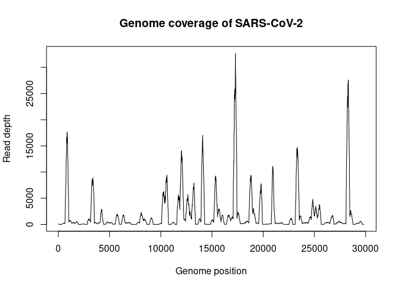
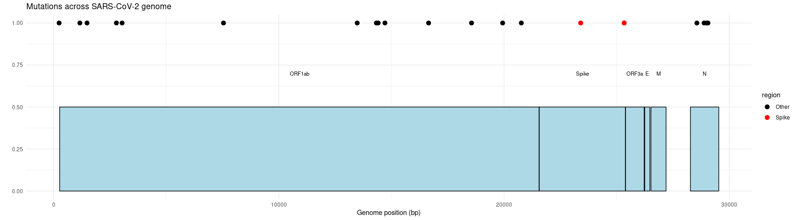
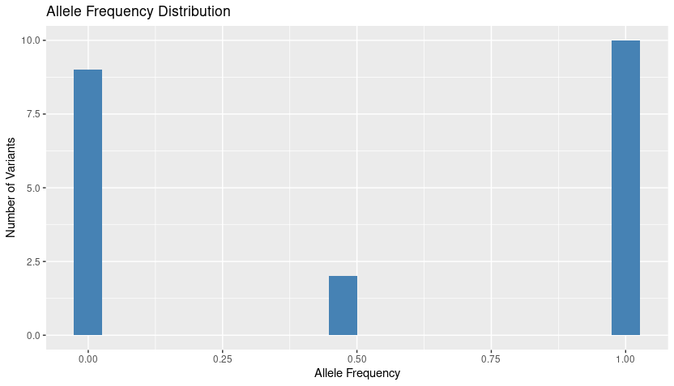

# SARS-CoV-2 Variant Analysis using NGS Data

Bioinformatics | NGS | Variant Calling | SARS-CoV-2

## Overview
This repository contains a bioinformatics workflow for the analysis of Next Generation Sequencing (NGS) data from the SARS-CoV-2 genome.

The dataset analyzed corresponds to viral genomic data generated during the early phase of the COVID-19 pandemic.

The objective of this project is to identify nucleotide substitutions in the viral genome using a reference-based alignment and variant calling pipeline, as well as to evaluate sequencing coverage and allele frequency distribution across the genome.

This project demonstrates a practical application of bioinformatics tools for viral genome analysis and variant interpretation.

---

## Reference Genome

The analysis uses the following reference genome:

AF086833.fasta

---

## Tools and Software

The analysis pipeline was performed using the following tools:

- BWA - read alignment
- Samtools - file processing and indexing
- FreeBayes - variant calling
- SnpEff - functional annotation of variants
- R - statistical analysis and visualization

### R packages used

- ggplot2
- Gviz
- VariantAnnotation
- kableExtra

---

### R packages used

- ggplot2
- Gviz
- VariantAnnotation
- kableExtra

---

## Workflow

The analysis pipeline consists of the following steps:

1. Reference genome indexing using BWA
   The SARS-CoV-2 reference genome was indexed using BWA.
     
2. Read alignment to the reference genome using BWA MEM
   Sequencing reads were aligned to the reference genome using BWA MEM.
     
3. SAM/BAM processing using Samtools
   Alignment files were converted, sorted, and indexed using SAMtools.
   
4. Variant calling 
   Genomic variants were detected using FreeBayes.
   
5. Variant analysis in R
   The resulting VCF file was analyzed using R to evaluate:
   - variant genomic positions
   - sequencing depth
   - allele frequency
   - mutation distribution across the genome
     
6. Visualization
   The following plots were generated:
   - Genome coverage plot
   - Manhattan plot of detected variants
   - Allele frequency distribution

---

## Repository Structure

sars-cov2-ngs-analysis/

data/
    reference genome and raw sequencing data

scripts/
    variant_analysis.R
    sra_explorer_fastq_download.sh

results/
    annotated_variants.vcf
    spike_mutations.vcf
    snpEff_genes.txt
    variant_count.txt
    mean_coverage.txt
    mapping_stats.txt

figures/
    generated plots

report/
    final PDF report describing the full analysis

---

## Workflow Summary

FASTQ  
↓  
BWA alignment  
↓  
SAM/BAM processing  
↓  
FreeBayes variant calling  
↓  
SnpEff variant annotation  
↓  
Variant analysis in R  
↓  
Visualization and report

---

## Example Variant Calls

| Position | Reference | Alternative | Depth | Caller |
|--------|--------|--------|--------|--------|
| 5876 | C | T | 2 | FreeBayes |
| 5954 | T | C | 2 | FreeBayes |

---

## Example Figures
The repository includes graphical summaries of the analysis:

- Genome Coverage Plot 
- Variant Manhattan Plot 
- Allelic Frequency Histogram 

These visualizations allow rapid inspection of mutation distribution and sequencing quality across the viral genome.

---

## Future Improvements

Possible improvements for this pipeline include:

functional annotation of variants
comparison with global SARS-CoV-2 mutation databases
phylogenetic analysis
integration with viral lineage classification tools

---

## Results

The repository includes processed outputs from the analysis, such as:

- annotated variant files (VCF)
- spike gene mutations
- coverage statistics
- mapping statistics
- variant count summaries

---

## Author

Jânice Roberta de Paula

Bioinformatics researcher interested in:

- genomics
- neurological genetics
- precision medicine
